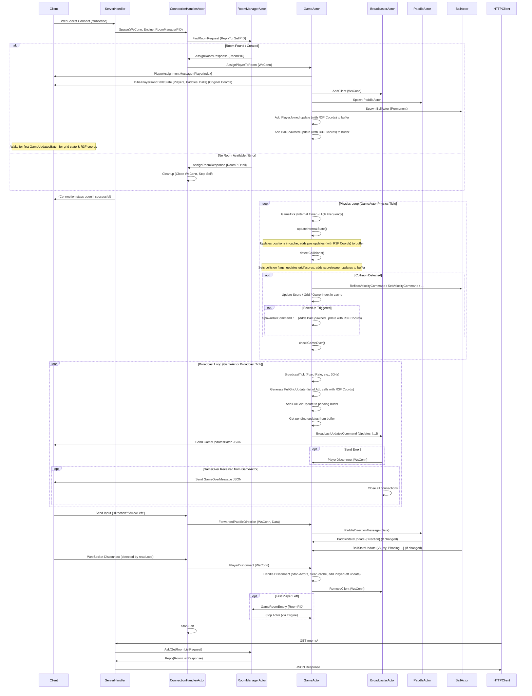

# PonGo: Multi-Room Pong/Breakout Hybrid

[](./README.md) [](https://github.com/lguibr/pongo/actions/workflows/test.yml) [](https://github.com/lguibr/pongo/actions/workflows/build.yml) [](https://github.com/lguibr/pongo/actions/workflows/lint.yml) [](https://hub.docker.com/r/lguibr/pongo)


Welcome to PonGo, a real-time multiplayer game combining elements of Pong and Breakout. This project features a Go backend built with a custom actor model library ([Bollywood](https://github.com/lguibr/bollywood)) designed for concurrency and scalability, supporting multiple independent game rooms.

## Table of Contents

- [PonGo: Multi-Room Pong/Breakout Hybrid](#pongo-multi-room-pongbreakout-hybrid)
  - [Table of Contents](#table-of-contents)
  - [1. Overview](#1-overview)
  - [2. Gameplay Rules](#2-gameplay-rules)
    - [2.1 Objective](#21-objective)
    - [2.2 Joining a Game](#22-joining-a-game)
    - [2.3 Paddle Control](#23-paddle-control)
    - [2.4 Balls](#24-balls)
    - [2.5 Collisions \& Scoring](#25-collisions--scoring)
    - [2.6 Bricks \& Power-ups](#26-bricks--power-ups)
    - [2.7 Winning/Losing](#27-winninglosing)
  - [3. Architecture](#3-architecture)
    - [3.1 Actor Model (Bollywood)](#31-actor-model-bollywood)
    - [3.2 Connection Handling (`ConnectionHandlerActor`)](#32-connection-handling-connectionhandleractor)
    - [3.3 Room Management (`RoomManagerActor`)](#33-room-management-roommanageractor)
    - [3.4 Game Room (`GameActor`)](#34-game-room-gameactor)
    - [3.5 Broadcasting (`BroadcasterActor`)](#35-broadcasting-broadcasteractor)
    - [3.6 Entity Actors (`PaddleActor`, `BallActor`)](#36-entity-actors-paddleactor-ballactor)
    - [3.7 Communication Flow (Diagram)](#37-communication-flow-diagram)
  - [4. Key Game Parameters](#4-key-game-parameters)
  - [5. Setup \& Running](#5-setup--running)
    - [5.1 Prerequisites](#51-prerequisites)
    - [5.2 Backend](#52-backend)
    - [5.3 Frontend](#53-frontend)
    - [5.4 Docker](#54-docker)
      - [5.4.1 Building Locally](#541-building-locally)
      - [5.4.2 Running Pre-built Image (Docker Hub)](#542-running-pre-built-image-docker-hub)
  - [6. Testing](#6-testing)
  - [7. API Endpoints](#7-api-endpoints)
  - [8. Submodules](#8-submodules)
  - [9. Contributing](#9-contributing)

## 1. Overview

PonGo pits up to four players against each other in a square arena filled with destructible bricks. Each player controls a paddle on one edge of the arena, defending their side and attempting to score points by hitting opponents' walls or destroying bricks. The game utilizes WebSockets for real-time communication and Go's concurrency features managed by the Bollywood actor library to handle game state and player interactions efficiently across multiple game rooms.

## 2. Gameplay Rules

### 2.1 Objective

The primary goal is to achieve the highest score by hitting opponent walls, destroying bricks, and outlasting other players. Players lose points when a ball hits their assigned wall. The game ends when all bricks are destroyed.

### 2.2 Joining a Game

-   Players connect via WebSocket to the server.
-   The server's **Room Manager** assigns the player to the first available game room (up to 4 players per room).
-   If all existing rooms are full, the Room Manager automatically creates a new room for the player.
-   Upon joining, the player is assigned an index (0-3), a paddle, a color, an initial score, and one **permanent ball**. The client receives initial messages containing their player index (`PlayerAssignmentMessage`) and the initial state of other entities (`InitialPlayersAndBallsState`). The grid state and all entity positions (pre-calculated for frontend rendering) are received via `FullGridUpdate` and other position updates within `GameUpdatesBatch` messages.

### 2.3 Paddle Control

-   Each player controls a paddle fixed to one edge:
    -   Player 0 (Right Edge): Vertical Paddle (Moves Up/Down)
    -   Player 1 (Top Edge): Horizontal Paddle (Moves Left/Right)
    -   Player 2 (Left Edge): Vertical Paddle (Moves Up/Down)
    -   Player 3 (Bottom Edge): Horizontal Paddle (Moves Left/Right)
-   Input commands (`ArrowLeft`, `ArrowRight`, `Stop`) control paddle movement *relative to its orientation*:
    -   **Vertical Paddles (0 & 2):**
        -   `ArrowLeft` -> Move **Up**
        -   `ArrowRight` -> Move **Down**
    -   **Horizontal Paddles (1 & 3):**
        -   `ArrowLeft` -> Move **Left**
        -   `ArrowRight` -> Move **Right**
    -   `Stop` (or releasing movement keys) -> **Stop** movement immediately.
-   Paddles are confined to their assigned edge and move at a configured velocity (`PaddleVelocity`). The `GameActor` calculates the paddle's position based on the last received direction command during its physics tick.

### 2.4 Balls

1.  **Permanent Ball:** Each player receives one **permanent ball** upon joining. This ball is associated with the player but is never removed from the game if it hits an empty wall (it reflects instead). Its ownership might change if another player hits it or if it hits its owner's wall.
2.  **Temporary Balls:** Additional balls can be spawned through power-ups. These balls *are* removed if they hit a wall belonging to an empty player slot. They also expire after a randomized duration.
3.  **Initial Spawn:** Permanent balls spawn near their owner's paddle with a randomized initial velocity vector.
4.  **Movement:** Balls move according to their velocity vector (`Vx`, `Vy`). The `GameActor` calculates the ball's position based on its current velocity during its physics tick.
5.  **Ownerless Ball:** If the last player in a room disconnects, one of their balls (preferably permanent) will be kept in play, marked as ownerless (`OwnerIndex = -1`) and permanent, ensuring the game always has at least one ball if players remain. A ball also becomes ownerless if it hits its owner's wall.

### 2.5 Collisions & Scoring

1.  **Wall Collision:**
    *   **Position Adjustment:** The ball's position is immediately adjusted to be slightly inside the boundary.
    *   **Velocity Reflection:** The ball's velocity component perpendicular to the wall is reversed (command sent to `BallActor`).
    *   **Active Player Wall:** If the wall belongs to a connected player (the "conceder"):
        *   The conceder loses 1 point.
        *   The player who last hit the ball (the "scorer", if valid and connected) gains 1 point, *unless* the scorer is the same as the conceder.
        *   **Hitting Own Wall:** If the ball's owner (`OwnerIndex`) is the same as the conceder index, the player loses 1 point, and the ball becomes ownerless (`OwnerIndex` is set to -1 in `GameActor`'s cache).
        *   Ownerless balls hitting an active player's wall cause the wall owner to lose 1 point.
    *   **Empty Player Slot Wall:**
        *   If the ball is **permanent**, it reflects as normal (no scoring).
        *   If the ball is **temporary**, it is removed from the game (`GameActor` stops the `BallActor`).
    *   **Phasing:** After any wall collision, the ball enters a brief "phasing" state (command sent to `BallActor`).
    *   **Collision Flag:** The ball's `Collided` flag is set to `true` in the `GameActor`'s cache and included in the next `BallPositionUpdate` message.

2.  **Paddle Collision:**
    *   **Dynamic Reflection:** The ball reflects off the paddle. The reflection angle depends on *where* the ball hits the paddle surface.
    *   **Speed Influence:** The paddle's current velocity component *along* the ball's reflection path influences the ball's resulting speed.
    *   **Ownership:** The player whose paddle was hit becomes the new owner of the ball (state updated in `GameActor`'s cache, `BallOwnershipChange` message sent).
    *   **Phasing:** The ball enters the phasing state (command sent to `BallActor`).
    *   **Collision Flag:** Both the ball's and the paddle's `Collided` flags are set to `true` in the `GameActor`'s cache and included in the next `BallPositionUpdate` and `PaddlePositionUpdate` messages.

3.  **Brick Collision:**
    *   **Damage:** The brick's `Life` decreases by 1 (state updated in `GameActor`'s grid, `FullGridUpdate` message sent on broadcast tick).
    *   **Reflection:** The ball reflects off the brick surface (command sent to `BallActor`).
    *   **Destruction:** If `Life` reaches 0:
        *   The brick is removed (`Type` becomes `Empty`).
        *   The ball's current owner (if valid and connected) gains points equal to the brick's initial `Level` (`ScoreUpdate` message sent).
        *   There's a chance (`PowerUpChance`) to trigger a random power-up.
    *   **Phasing:** The ball enters the phasing state (command sent to `BallActor`). Bricks cannot be hit by phasing balls.
    *   **Collision Flag:** The ball's `Collided` flag is set to `true` in the `GameActor`'s cache and included in the next `BallPositionUpdate` message.

### 2.6 Bricks & Power-ups

-   **Bricks:** Occupy cells in the central grid. They have `Life` (hit points) and `Level` (points awarded on destruction). The grid is procedurally generated when a room is created.
-   **Power-ups:** Triggered randomly when a brick is destroyed. Effects apply to the ball that broke the brick or spawn new entities:
    -   **Spawn Ball:** Creates a new temporary ball near the broken brick, owned by the player who broke the brick (`GameActor` spawns a new `BallActor`, `BallSpawned` message sent).
    -   **Increase Mass:** Increases the mass and radius of the ball that broke the brick (command sent to `BallActor`).
    -   **Increase Velocity:** Increases the speed of the ball that broke the brick (command sent to `BallActor`).

### 2.7 Winning/Losing

-   The game ends when all bricks in the grid are destroyed.
-   The player with the highest score at the end wins. Ties are possible.
-   Players effectively "lose" if they disconnect before the game ends.
-   If all players disconnect, the room becomes empty and is eventually cleaned up by the Room Manager.
-   A `GameOverMessage` is broadcast when the game ends.

## 3. Architecture

PonGo uses an Actor Model architecture facilitated by the [Bollywood](https://github.com/lguibr/bollywood) library. This promotes concurrency and isolates state management. The simulation logic (physics) runs at a higher frequency, while network updates are sent at a fixed, lower frequency (e.g., 30Hz) as batches of atomic updates.

### 3.1 Actor Model (Bollywood)

-   Actors are independent units of computation with private state.
-   They communicate solely through asynchronous messages (`Send`) or synchronous request/reply (`Ask`).
-   The `Engine` manages actor lifecycles (spawning, stopping) and message routing.
-   Actors use the `Context` provided in `Receive` to interact.

### 3.2 Connection Handling (`ConnectionHandlerActor`)

-   A dedicated, short-lived actor spawned by the server for each new WebSocket connection.
-   **Responsibilities:**
    -   Asks the `RoomManagerActor` for a game room assignment (`FindRoomRequest`).
    -   Receives the assigned `GameActor` PID (`AssignRoomResponse`).
    -   Sends `AssignPlayerToRoom` *directly* to the assigned `GameActor`.
    -   Manages the `readLoop` for the WebSocket connection, signaling its exit to the main actor loop.
    -   Forwards player input (`ForwardedPaddleDirection`) *directly* to the assigned `GameActor`.
    -   Sends `PlayerDisconnect` *directly* to the assigned `GameActor` upon connection error or closure (detected by `readLoop` or `Stopping` handler).
    -   Stops itself when the connection terminates or the actor is stopped by the server. Ensures `readLoop` is stopped before fully exiting.

### 3.3 Room Management (`RoomManagerActor`)

-   A central actor managing the list of active game rooms.
-   **Responsibilities:**
    -   Handles `FindRoomRequest` from `ConnectionHandlerActor`.
    -   Finds an existing `GameActor` (room) with space or spawns a new one (up to a limit).
    -   Replies to `ConnectionHandlerActor` with the assigned `GameActor` PID (`AssignRoomResponse`).
    -   Receives notifications (`GameRoomEmpty`) from `GameActors` when they become empty or finish.
    -   Stops empty/finished `GameActors` using `engine.Stop()` and removes them from the active list.
    -   Handles requests for the list of active rooms (`GetRoomListRequest` from HTTP handler via `Ask`) and replies using `ctx.Reply()`.
    -   **Does NOT directly interact with WebSockets or handle player input.**

### 3.4 Game Room (`GameActor`)

-   Each instance represents a single, independent game room (max 4 players).
-   **Responsibilities:**
    -   Manages the core state of a specific game: Canvas, Grid, Players, Scores.
    -   Maintains the **authoritative local cache** of `Paddle` and `Ball` states (position, velocity, phasing, direction, etc.), including temporary `Collided` flags.
    -   Handles player connections/disconnections (`AssignPlayerToRoom`, `PlayerDisconnect`) *initiated by ConnectionHandlerActor*. Sends initial state (`PlayerAssignmentMessage`, `InitialPlayersAndBallsState`) directly to the connecting client.
    -   Spawns and supervises child actors (`PaddleActor`, `BallActor`) and a `BroadcasterActor`.
    -   Runs two internal tickers:
        *   `physicsTicker` (high frequency, e.g., 60Hz): Triggers `GameTick`.
        *   `broadcastTicker` (fixed rate, e.g., 30Hz): Triggers `BroadcastTick`.
    -   On `GameTick`:
        *   Updates positions of paddles and balls in its local cache based on their current velocity/direction (`updateInternalState`). Calculates centered R3F coordinates (`r3fX`, `r3fY`) for each entity. Generates atomic position update messages (`BallPositionUpdate`, `PaddlePositionUpdate`) containing both original and R3F coordinates, and adds them to a pending buffer. Resets internal `Collided` flags after generating updates.
        *   Performs collision detection and physics calculations using its updated cache (`detectCollisions`). Sets internal `Collided` flags upon detection. Generates atomic update messages for score changes (`ScoreUpdate`), ball ownership changes (`BallOwnershipChange`), etc., and adds them to the pending buffer. Brick updates are now handled implicitly by the `FullGridUpdate` sent on `BroadcastTick`.
        *   Sends commands (`SetVelocity`, `ReflectVelocity`, `SetPhasing`, `PaddleDirectionMessage`, etc.) to child actors based on collision results or player input.
        *   Updates scores and grid state in its cache. Implements the "hit own wall" logic (score penalty, lose ownership).
        *   Handles power-up logic (spawning new balls (`BallSpawned` update with R3F coords), sending commands to existing balls).
        *   Checks for game end condition (all bricks destroyed) and triggers game over sequence (stops tickers, sends `GameOverMessage`, notifies `RoomManagerActor`, stops self).
    -   On `BroadcastTick`:
        *   Generates a `FullGridUpdate` message containing a flat list of the state and pre-calculated R3F coordinates of **all** grid cells (`BrickStateUpdate`). Adds this to the pending buffer.
        *   Takes all pending atomic update messages (including the grid update) from the buffer.
        *   Sends them as a single batch (`BroadcastUpdatesCommand`) to its `BroadcasterActor`.
    -   Implements the "persistent ball" logic on player disconnect.
    -   Notifies the `RoomManagerActor` when it becomes empty or finishes (`GameRoomEmpty`).
    -   Handles cleanup of tickers and child actors reliably during `Stopping` or panic recovery using `sync.Once`.
    -   **Does NOT receive position updates from child actors.** Receives internal state updates (`PaddleStateUpdate`, `BallStateUpdate`) from children.

### 3.5 Broadcasting (`BroadcasterActor`)

-   A dedicated actor spawned by each `GameActor`.
-   **Responsibilities:**
    -   Maintains the list of active WebSocket connections for its specific room (`AddClient`, `RemoveClient`).
    -   Receives batches of atomic updates (`BroadcastUpdatesCommand`) from its parent `GameActor`.
    -   Wraps the batch in a `GameUpdatesBatch` message.
    -   Marshals the batch message to JSON.
    -   Sends the JSON payload to all connected clients in its room asynchronously.
    -   Handles WebSocket write errors and notifies the `GameActor` of disconnections detected during broadcast.
    -   Handles `GameOverMessage` by sending it to all clients and then closing their connections.

### 3.6 Entity Actors (`PaddleActor`, `BallActor`)

-   **`PaddleActor`:** Manages the internal state (`Direction`) of a single paddle based on `PaddleDirectionMessage` from `GameActor`. Sends `PaddleStateUpdate` back to `GameActor` when its internal direction changes. Does *not* update its own position or send position updates back.
-   **`BallActor`:** Manages the internal state (velocity, phasing, mass) of a single ball based on commands (`SetVelocity`, `ReflectVelocity`, `SetPhasing`, etc.) from `GameActor`. Sends `BallStateUpdate` back to `GameActor` when its internal state changes. Does *not* update its own position or send position updates back.

### 3.7 Communication Flow (Diagram)



## 4. Key Game Parameters

All major game parameters are configurable in `utils/config.go`. See the `DefaultConfig()` function for default values. Key parameters include:

-   `GameTickPeriod`: (Default: 24ms) Frequency of physics simulation updates.
-   `BroadcastRateHz`: (Default: 30) Target frequency of sending game state update batches to clients.
-   `CanvasSize`, `GridSize`, `CellSize`
-   `InitialScore`
-   `PaddleLength`, `PaddleWidth`, `PaddleVelocity`
-   `MinBallVelocity`, `MaxBallVelocity`, `BallRadius`, `BallMass`, `BallPhasingTime`
-   Paddle/Ball collision physics factors (`BallHitPaddleSpeedFactor`, `BallHitPaddleAngleFactor`)
-   Grid generation parameters
-   Power-up chances and parameters (`PowerUpChance`, `PowerUpSpawnBallExpiry`, etc.)

## 5. Setup & Running

### 5.1 Prerequisites

-   Go (version 1.19 or later recommended)
-   Git
-   Docker (Optional, for containerized deployment)
-   Node.js/npm (For running the frontend)

### 5.2 Backend

1.  **Clone the repository:**
    ```bash
    git clone https://github.com/lguibr/pongo.git
    cd pongo
    ```
2.  **Fetch dependencies:**
    ```bash
    go mod tidy
    ```
3.  **Run the server:**
    ```bash
    go run main.go
    ```
    The backend server will start, typically on `http://localhost:8080`.

### 5.3 Frontend

1.  **Navigate to the frontend directory:**
    ```bash
    cd frontend
    ```
2.  **Install dependencies:**
    ```bash
    npm install
    ```
3.  **Start the development server:**
    ```bash
    npm run dev
    ```
    The frontend will usually be available at `http://localhost:5173` (or similar, check console output). Open this URL in your browser.

### 5.4 Docker

#### 5.4.1 Building Locally

1.  **Build the backend image:**
    ```bash
    docker build -t pongo-backend .
    ```
2.  **Run the backend container:**
    ```bash
    docker run -p 8080:8080 pongo-backend
    ```
    (Ensure the frontend is configured to connect to the backend at the correct address if running separately).


#### 5.4.2 Running Pre-built Image (Docker Hub)

A pre-built image is automatically pushed to Docker Hub from the `main` branch. Replace `lguibr` with the correct Docker Hub username if it differs.

1.  **Pull the latest image:**
    ```bash
    docker pull lguibr/pongo:latest
    ```
2.  **Run the container (mapping port 8080):**
    ```bash
    # Map host port 8080 to container port 8080
    docker run -d -p 8080:8080 --name pongo-server lguibr/pongo:latest
    ```
    This runs the container in detached mode (`-d`) and maps port 8080. The frontend should be configured to connect to `ws://<your-docker-host-ip>:8080/subscribe`.


## 6. Testing

-   **Unit Tests:** Run standard Go tests.
    ```bash
    go test ./...
    ```
-   **Linting:** Uses `golangci-lint`. Ensure it's installed or run via CI.
    ```bash
    golangci-lint run ./...
    ```
-   **End-to-End (E2E) Tests:** Located in the `test/` directory. These simulate client connections and interactions using the atomic update protocol.
    ```bash
    go test ./test -v -run E2E
    ```
-   **Coverage:** Generate coverage reports.
    ```bash
    go test -coverprofile=coverage.out ./...
    go tool cover -html=coverage.out
    ```
-   **Profiling E2E Tests:** Run E2E tests with CPU and memory profiling enabled. Output files (`cpu.prof`, `mem.prof`) are saved to the project root.
    ```bash
    # Run via the build script which includes the profiling step
    ./build_test.sh
    # Or run manually:
    go test ./test -v -race -run E2E -cpuprofile cpu.prof -memprofile mem.prof
    # Analyze profiles using pprof:
    go tool pprof cpu.prof
    go tool pprof mem.prof
    ```
-   **Build & Test Script:** A comprehensive script `build_test.sh` runs cleaning, building, unit tests, E2E tests (standard and profiled), stress tests, and coverage generation.
    ```bash
    ./build_test.sh
    ```

## 7. API Endpoints

-   **`ws://<host>:8080/subscribe`**: The primary WebSocket endpoint for game clients to connect.
-   **`http://<host>:8080/rooms/`**: HTTP GET endpoint. Returns a JSON object listing active game rooms (by PID string) and their current player counts (e.g., `{"actor-1": 2, "actor-3": 4}`).
-   **`http://<host>:8080/`**: HTTP GET endpoint for health check. Returns `{"status": "ok"}`.
-   **`http://<host>:8080/health-check/`**: Explicit health check endpoint. Returns `{"status": "ok"}`.

## 8. Submodules

*   [Game Logic](./game/README.md): Core gameplay, actor implementations (GameActor, PaddleActor, BallActor), Room Manager.
*   [Server](./server/README.md): HTTP/WebSocket connection handling, interaction with Room Manager.
*   [Bollywood Actor Library](./bollywood/README.md): External actor library dependency.
*   [Utilities](./utils/README.md): Configuration (`config.go`), constants, helper functions.
*   [Frontend](./frontend/README.md): React frontend application.

## 9. Contributing

Contributions are welcome! Please follow standard Go practices, ensure tests pass, and update documentation as needed. Open an issue to discuss major changes.
