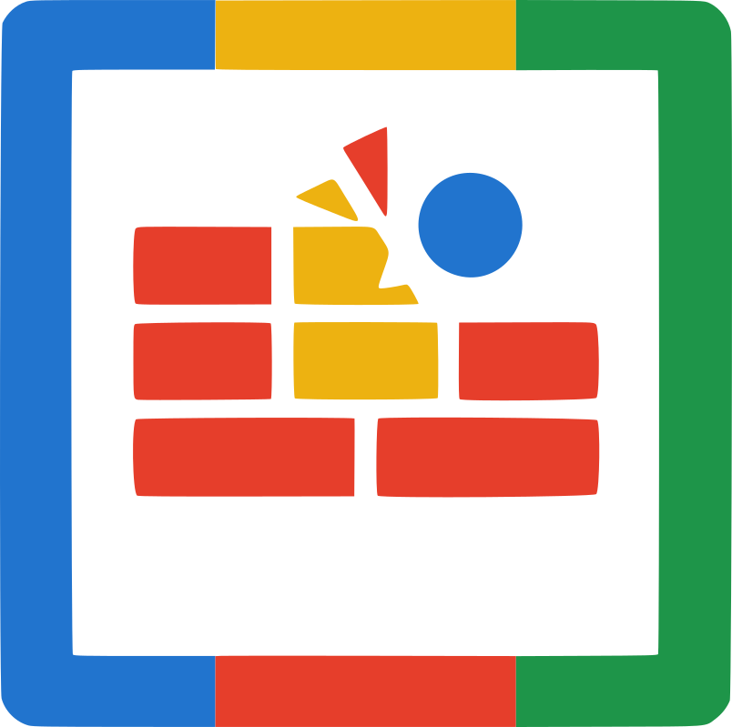

# PonGo

   

Welcome to my Pong and Breaking Brick Game!



This game combines elements of the classic Pong game with the gameplay of breaking brick games. The backend of the game is written in Go and utilizes the Actor Model pattern via the [Bollywood actor library](./bollywood/README.md) to handle different game elements, such as player input, game state, paddle movement, and ball movement. The game has zero external dependencies beyond the standard library and the websocket package (and the internal Bollywood library).

The core entities in the game are implemented as actors, including the Player connection, GameState, Paddle, and Ball. Communication happens asynchronously via messages.

## Submodules

*   [Game Logic](./game/README.md): Contains the core game rules, state, and actor implementations.
*   [Bollywood Actor Library](./bollywood/README.md): Provides the underlying actor model implementation.

## Getting Started

To run the game, you will need to have Go installed on your system. Once you have Go installed, clone the repository and run the following command in the project directory:

```bash
go run main.go
```

This will start the game server on `localhost:3001`.

## Gameplay

The goal of the game is to break all of the bricks on the grid while keeping the ball from falling past the paddle. The player controls the paddle by sending input to the server via WebSockets.

The game state is managed by a central `GameActor` that receives updates from `BallActor`s and `PaddleActor`s and evaluates collisions. The next state of the game is then sent to the player's WebSocket connection (managed by a `PlayerActor`).

Paddle movement is handled by a `PaddleActor` that processes direction input and periodically updates its position, sending updates to the `GameActor`.

Ball movement is handled by `BallActor`s. Each `BallActor` processes its position and sends updates to the `GameActor`. The `GameActor` processes collisions and sends messages back to the `BallActor` to adjust velocity or handle brick breaks/wall hits.

## Build

To build the game, you can use the following command:

```bash
go build
```

## Testing

To test the game, you can use the following command:

```bash
# Note: Tests might need updates after the actor refactoring
go test ./...
```

_Note that you should be in the project folder where the game files are located before running these commands._
