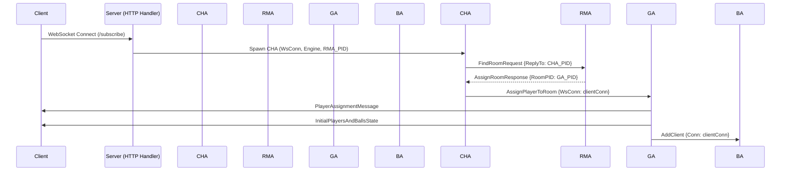
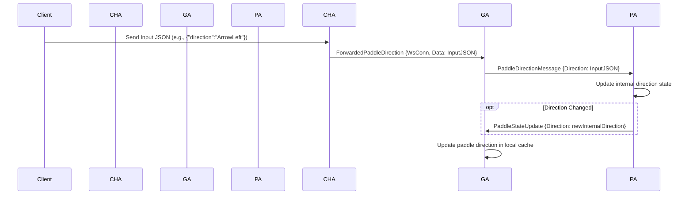
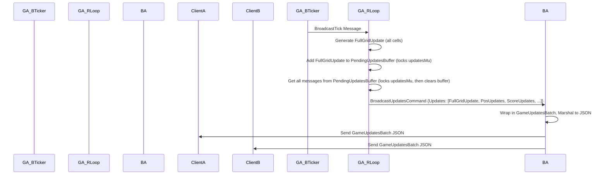
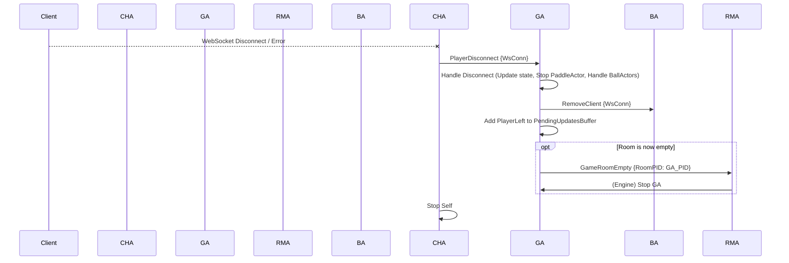
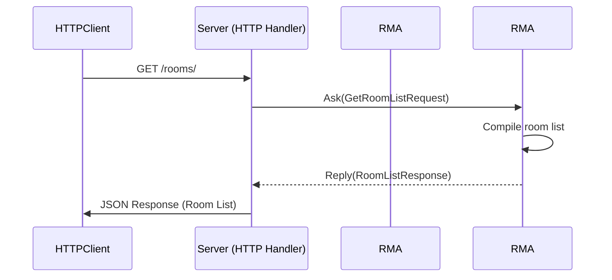

# PonGo: Multi-Room Pong/Breakout Hybrid


Welcome to PonGo, a real-time multiplayer game combining elements of Pong and Breakout. This project features a Go backend built with a custom actor model library ([Bollywood](https://github.com/lguibr/bollywood)) designed for concurrency and scalability, supporting multiple independent game rooms.

## Table of Contents

- [PonGo: Multi-Room Pong/Breakout Hybrid](#pongo-multi-room-pongbreakout-hybrid)
  - [Table of Contents](#table-of-contents)
  - [1. Overview](#1-overview)
  - [2. Gameplay Rules](#2-gameplay-rules)
    - [2.1 Objective](#21-objective)
    - [2.2 Joining a Game](#22-joining-a-game)
    - [2.3 Paddle Control](#23-paddle-control)
    - [2.4 Balls](#24-balls)
    - [2.5 Collisions \& Scoring](#25-collisions--scoring)
    - [2.6 Bricks \& Power-ups](#26-bricks--power-ups)
    - [2.7 Winning/Losing](#27-winninglosing)
  - [3. Architecture](#3-architecture)
    - [3.1 Actor Model (Bollywood)](#31-actor-model-bollywood)
    - [3.2 Core Actors and Responsibilities](#32-core-actors-and-responsibilities)
      - [3.2.1 `ConnectionHandlerActor`](#321-connectionhandleractor)
      - [3.2.2 `RoomManagerActor`](#322-roommanageractor)
      - [3.2.3 `GameActor`](#323-gameactor)
      - [3.2.4 `BroadcasterActor`](#324-broadcasteractor)
      - [3.2.5 Entity Actors (`PaddleActor`, `BallActor`)](#325-entity-actors-paddleactor-ballactor)
    - [3.3 Key Interaction Flows and Concurrency](#33-key-interaction-flows-and-concurrency)
      - [3.3.1 New Client Connection \& Room Assignment](#331-new-client-connection--room-assignment)
      - [3.3.2 Player Input Processing](#332-player-input-processing)
      - [3.3.3 Game Simulation Loop (`GameActor` - Physics Tick)](#333-game-simulation-loop-gameactor---physics-tick)
      - [3.3.4 State Broadcasting Loop (`GameActor` - Broadcast Tick)](#334-state-broadcasting-loop-gameactor---broadcast-tick)
      - [3.3.5 Player Disconnection](#335-player-disconnection)
      - [3.3.6 HTTP Room List Query](#336-http-room-list-query)
      - [3.3.7 Actor Supervision and Cleanup](#337-actor-supervision-and-cleanup)
  - [4. Key Game Parameters](#4-key-game-parameters)
  - [5. Setup \& Running](#5-setup--running)
    - [5.1 Prerequisites](#51-prerequisites)
    - [5.2 Backend](#52-backend)
    - [5.3 Frontend](#53-frontend)
    - [5.4 Docker](#54-docker)
      - [5.4.1 Building Locally](#541-building-locally)
      - [5.4.2 Running Pre-built Image (Docker Hub)](#542-running-pre-built-image-docker-hub)
  - [6. Testing](#6-testing)
  - [7. API Endpoints](#7-api-endpoints)
  - [8. Submodules](#8-submodules)
  - [9. Contributing](#9-contributing)

## 1. Overview

PonGo pits up to four players against each other in a square arena filled with destructible bricks. Each player controls a paddle on one edge of the arena, defending their side and attempting to score points by hitting opponents' walls or destroying bricks. The game utilizes WebSockets for real-time communication and Go's concurrency features managed by the Bollywood actor library to handle game state and player interactions efficiently across multiple game rooms.

## 2. Gameplay Rules

### 2.1 Objective

The primary goal is to achieve the highest score by hitting opponent walls, destroying bricks, and outlasting other players. Players lose points when a ball hits their assigned wall. The game ends when all bricks are destroyed.

### 2.2 Joining a Game

-   Players connect via WebSocket to the server.
-   The server's **Room Manager** assigns the player to the first available game room (up to 4 players per room).
-   If all existing rooms are full, the Room Manager automatically creates a new room for the player.
-   Upon joining, the player is assigned an index (0-3), a paddle, a color, and one **permanent ball**.
    -   If the player is the first to join the room, their initial score is set according to the game configuration (e.g., 0).
    -   If other players are already in the room, the new player's initial score is set to the average score of the currently connected players in that room.
-   The client receives initial messages containing their player index (`PlayerAssignmentMessage`) and the initial state of other entities (`InitialPlayersAndBallsState`). The grid state and all entity positions (pre-calculated for frontend rendering) are received via `FullGridUpdate` and other position updates within `GameUpdatesBatch` messages.

### 2.3 Paddle Control

-   Each player controls a paddle fixed to one edge:
    -   Player 0 (Right Edge): Vertical Paddle (Moves Up/Down)
    -   Player 1 (Top Edge): Horizontal Paddle (Moves Left/Right)
    -   Player 2 (Left Edge): Vertical Paddle (Moves Up/Down)
    -   Player 3 (Bottom Edge): Horizontal Paddle (Moves Left/Right)
-   Input commands (`ArrowLeft`, `ArrowRight`, `Stop`) control paddle movement *relative to its orientation*:
    -   **Vertical Paddles (0 & 2):**
        -   `ArrowLeft` -> Move **Up**
        -   `ArrowRight` -> Move **Down**
    -   **Horizontal Paddles (1 & 3):**
        -   `ArrowLeft` -> Move **Left**
        -   `ArrowRight` -> Move **Right**
    -   `Stop` (or releasing movement keys) -> **Stop** movement immediately.
-   Paddles are confined to their assigned edge and move at a configured velocity (`PaddleVelocity`). The `GameActor` calculates the paddle's position based on the last received direction command during its physics tick.

### 2.4 Balls

1.  **Permanent Ball:** Each player receives one **permanent ball** upon joining. This ball is associated with the player but is never removed from the game if it hits an empty wall (it reflects instead). Its ownership might change if another player hits it or if it hits its owner's wall.
2.  **Temporary Balls:** Additional balls can be spawned through the "Spawn Ball" power-up. These balls are *not* initially phasing and *are* removed if they hit a wall belonging to an empty player slot. They also expire after a randomized duration (`PowerUpSpawnBallExpiry`).
3.  **Initial Spawn:** Permanent balls spawn near their owner's paddle with a randomized initial velocity vector. They are *not* initially phasing.
4.  **Movement:** Balls move according to their velocity vector (`Vx`, `Vy`). The `GameActor` calculates the ball's position based on its current velocity during its physics tick. Ball positions are not forcibly adjusted upon collision; instead, their velocity is reflected, ensuring continuous movement.
5.  **Ownerless Ball:** If the last player in a room disconnects, one of their balls (preferably permanent) will be kept in play, marked as ownerless (`OwnerIndex = -1`) and permanent, ensuring the game always has at least one ball if players remain. A ball also becomes ownerless if it hits its owner's wall.
6.  **Phasing:**
    *   Phasing is a temporary state initiated *only* by the "Start Phasing" power-up, which is randomly triggered when a brick is destroyed.
    *   The ball that broke the brick (and triggered the power-up) will enter a "phasing" state for a short duration (`BallPhasingTime`).
    *   While phasing, a ball will pass through bricks, damaging each unique brick cell it intersects once per phasing cycle, but it will not reflect off them.
    *   Phasing balls **do** reflect normally off walls and paddles, and their ownership can change upon paddle collision. These reflections do not reset the phasing timer or affect the phasing state.
    *   Once the phasing timer expires, the ball returns to a non-phasing state.
    *   A non-phasing ball *cannot* re-enter the phasing state by hitting walls or paddles. It can only become phasing again if another "Start Phasing" power-up is acquired for that ball.

### 2.5 Collisions & Scoring

1.  **Wall Collision:**
    *   **Velocity Reflection:** The ball's velocity component perpendicular to the wall is reversed (command sent to `BallActor`). The ball's position is *not* snapped to the wall; it reflects based on its current trajectory.
    *   **Active Player Wall (Non-Phasing Ball):** If the wall belongs to a connected player (the "conceder") and the ball is *not* phasing:
        *   The conceder loses 1 point.
        *   The player who last hit the ball (the "scorer", if valid and connected) gains 1 point, *unless* the scorer is the same as the conceder.
        *   **Hitting Own Wall:** If the ball's owner (`OwnerIndex`) is the same as the conceder index, the player loses 1 point, and the ball becomes ownerless (`OwnerIndex` is set to -1 in `GameActor`'s cache).
        *   Ownerless non-phasing balls hitting an active player's wall cause the wall owner to lose 1 point.
    *   **Empty Player Slot Wall (Non-Phasing Ball):**
        *   If the ball is **permanent** and not phasing, it reflects as normal (no scoring).
        *   If the ball is **temporary** and not phasing, it is removed from the game (`GameActor` stops the `BallActor`).
    *   **Phasing Ball Wall Collision:** The ball reflects normally, but no scoring occurs, and its phasing state is unaffected.
    *   **Collision Flag:** The ball's `Collided` flag is set to `true` in the `GameActor`'s cache and included in the next `BallPositionUpdate` message.

2.  **Paddle Collision:**
    *   **Dynamic Reflection:** The ball reflects off the paddle. The reflection angle depends on *where* the ball hits the paddle surface. The ball's position is *not* snapped; velocity is reflected.
    *   **Speed Influence:** The paddle's current velocity component *along* the ball's reflection path influences the ball's resulting speed.
    *   **Ownership:** The player whose paddle was hit becomes the new owner of the ball (state updated in `GameActor`'s cache, `BallOwnershipChange` message sent).
    *   **Phasing Ball Paddle Collision:** The ball reflects and changes owner as above, but its phasing state is unaffected.
    *   **Collision Flag:** Both the ball's and the paddle's `Collided` flags are set to `true` in the `GameActor`'s cache and included in the next `BallPositionUpdate` and `PaddlePositionUpdate` messages.

3.  **Brick Collision:**
    *   **Phasing Ball:** Passes through, damaging each unique brick cell once per phasing cycle. Does not reflect.
    *   **Non-Phasing Ball:**
        *   **Damage:** The brick's `Life` decreases by 1 (state updated in `GameActor`'s grid, `FullGridUpdate` message sent on broadcast tick).
        *   **Reflection:** The ball reflects off the brick surface (command sent to `BallActor`). The ball's position is *not* snapped; velocity is reflected.
        *   **Destruction:** If `Life` reaches 0:
            *   The brick is removed (`Type` becomes `Empty`).
            *   The ball's current owner (if valid and connected) gains points equal to the brick's initial `Level` (`ScoreUpdate` message sent).
            *   There's a chance (`PowerUpChance`) to trigger a random power-up.
        *   **Collision Flag:** The ball's `Collided` flag is set to `true` in the `GameActor`'s cache and included in the next `BallPositionUpdate` message. (Note: Phasing is no longer initiated here, only by power-up).

### 2.6 Bricks & Power-ups

-   **Bricks:** Occupy cells in the central grid. They have `Life` (hit points) and `Level` (points awarded on destruction). The grid is procedurally generated when a room is created.
-   **Power-ups:** Triggered randomly (`PowerUpChance`) when a brick is destroyed. One of the following effects is chosen and applied to the ball that broke the brick (unless specified otherwise):
    -   **Spawn Ball:** Creates a new temporary, *non-phasing* ball near the broken brick, owned by the player who broke the brick. This ball expires after `PowerUpSpawnBallExpiry`. (`GameActor` spawns a new `BallActor`, `BallSpawned` message sent).
    -   **Increase Mass:** Increases the mass and radius of the ball.
    -   **Increase Velocity:** Increases the speed of the ball.
    -   **Start Phasing:** The ball enters the "phasing" state for `BallPhasingTime`.

### 2.7 Winning/Losing

-   The game ends when all bricks in the grid are destroyed.
-   The player with the highest score at the end wins. Ties are possible.
-   Players effectively "lose" if they disconnect before the game ends.
-   If all players disconnect, the room becomes empty and is eventually cleaned up by the Room Manager.
-   A `GameOverMessage` is broadcast when the game ends.

## 3. Architecture

PonGo uses an Actor Model architecture facilitated by the [Bollywood](https://github.com/lguibr/bollywood) library. This promotes concurrency and isolates state management.

### 3.1 Actor Model (Bollywood)

-   **Actors**: Independent units of computation with private state. They encapsulate behavior and data.
-   **Communication**: Actors interact solely through asynchronous messages (`Send`) or synchronous request/reply patterns (`Ask`). This avoids direct memory sharing and potential race conditions.
-   **Engine**: The Bollywood `Engine` manages actor lifecycles (spawning, stopping) and message routing.
-   **Context**: Within an actor's `Receive` method, a `Context` object provides access to `Self()` (the actor's own PID), `Sender()` (the PID of the message sender, if any), and methods to interact with the `Engine` (e.g., `ctx.Engine().Send(...)`, `ctx.Engine().Stop(...)`, `ctx.Reply(...)`).

### 3.2 Core Actors and Responsibilities

The system is composed of several key actor types:

#### 3.2.1 `ConnectionHandlerActor`

-   **Lifecycle**: Short-lived; one instance per WebSocket connection.
-   **Responsibilities**:
    -   Manages the `readLoop` for a single WebSocket connection, parsing incoming JSON messages.
    -   On startup, requests a room assignment from the `RoomManagerActor`.
    -   Upon receiving a room assignment (a `GameActor` PID), it informs the `GameActor` to assign the player.
    -   Forwards player input messages (e.g., paddle movement) directly to the assigned `GameActor`.
    -   Monitors the WebSocket connection. If the connection closes or an error occurs in the `readLoop`, it sends a `PlayerDisconnect` message to the `GameActor` and then stops itself.
    -   Ensures its `readLoop` is properly terminated before the actor fully stops to prevent goroutine leaks.

#### 3.2.2 `RoomManagerActor`

-   **Lifecycle**: Long-lived; a single instance acts as the central coordinator for game rooms.
-   **Responsibilities**:
    -   Maintains a list of active `GameActor` PIDs and their approximate player counts.
    -   Handles `FindRoomRequest` messages from `ConnectionHandlerActor`s:
        -   Attempts to find an existing `GameActor` with available player slots.
        -   If no suitable room exists and the maximum room limit (`maxRooms`) hasn't been reached, it spawns a new `GameActor`.
        -   Replies to the `ConnectionHandlerActor` with an `AssignRoomResponse` containing the PID of the assigned `GameActor` (or `nil` if no room is available).
    -   Handles `GameRoomEmpty` messages from `GameActor`s (when a room becomes empty or a game ends). It then stops the specified `GameActor` (via `engine.Stop()`) and removes it from its list of active rooms.
    -   Handles `GetRoomListRequest` messages (typically via `Ask` from an HTTP handler) by replying with a `RoomListResponse` containing the current rooms and player counts.
    -   Does **not** directly interact with WebSockets or handle player-specific game logic.

#### 3.2.3 `GameActor`

-   **Lifecycle**: One instance per active game room; created by `RoomManagerActor`, stopped when empty or game over.
-   **Core Responsibilities**:
    -   Manages the complete state of a single game room, including the game canvas, grid of bricks, player information (scores, connected status), and all active game entities (paddles, balls).
    -   Maintains the **authoritative local cache** of `Paddle` and `Ball` states (position, velocity, current direction, phasing status, mass, radius, etc.). This cache is crucial for physics calculations.
    -   Handles `AssignPlayerToRoom` messages from `ConnectionHandlerActor`:
        -   Adds the new player to the room.
        -   Calculates the player's initial score (average of existing players if any, otherwise default).
        -   Spawns a `PaddleActor` and a permanent `BallActor` for the new player.
        -   Sends initial state messages (`PlayerAssignmentMessage`, `InitialPlayersAndBallsState`) directly to the newly connected client's WebSocket.
        -   Adds a `PlayerJoined` update to its broadcast buffer.
    -   Handles `PlayerDisconnect` messages from `ConnectionHandlerActor` or `BroadcasterActor`:
        -   Updates the player's status.
        -   Stops the player's `PaddleActor` and associated `BallActor`s (unless a ball needs to be kept for the "persistent ball" logic).
        -   Adds a `PlayerLeft` update to its broadcast buffer.
        -   If the room becomes empty, sends `GameRoomEmpty` to `RoomManagerActor`.
    -   Handles `ForwardedPaddleDirection` messages from `ConnectionHandlerActor` by forwarding them to the appropriate child `PaddleActor`.
    -   Receives internal state updates (`PaddleStateUpdate`, `BallStateUpdate`) from its child entity actors and updates its local cache accordingly (e.g., paddle direction, ball's internal velocity/phasing from `BallActor`).
-   **Internal Game Loop & Tickers**:
    -   The `GameActor` runs two primary internal tickers, managed using Go's `time.Ticker` and `select` statements in dedicated goroutines. These goroutines send messages (`GameTick`, `BroadcastTick`) back to the `GameActor`'s own mailbox to be processed within its `Receive` loop, ensuring serial access to its state.
    -   `physicsTicker` (`GameTick`): Runs at a high frequency (e.g., 60Hz, defined by `cfg.GameTickPeriod`).
        -   **`moveEntities()`**: Updates the positions of all paddles and balls in its local cache based on their current velocities and directions from the *previous* tick.
        -   **`detectCollisions()`**: Using the updated cache, performs collision detection (ball-wall, ball-paddle, ball-brick).
            -   Resolves collisions by updating cached entity states (e.g., reflecting ball velocity, changing ball ownership). **Crucially, direct position adjustments (snapping) are avoided; only velocities are changed.**
            -   Sends commands (e.g., `SetVelocityCommand`, `SetPhasingCommand`, `StopPhasingCommand`) to child `BallActor`s or `PaddleActor`s to update their internal states.
            -   Handles scoring and power-up activation.
            -   Generates atomic game event updates (e.g., `ScoreUpdate`, `BallOwnershipChange`) and adds them to the pending update buffer.
        -   **`generatePositionUpdates()`**: Creates `BallPositionUpdate` and `PaddlePositionUpdate` messages from the final cached state of the current tick.
        -   **`resetPerTickCollisionFlags()`**: Resets `Collided` flags in the cache for the next tick.
        -   **`checkGameOver()`**: Checks if all bricks are destroyed. If so, triggers the game over sequence.
    -   `broadcastTicker` (`BroadcastTick`): Runs at a fixed rate (e.g., 30Hz, defined by `cfg.BroadcastRateHz`).
        -   **`handleBroadcastTick()`**: Generates a `FullGridUpdate` message.
        -   It then takes all messages currently in the `pendingUpdates` buffer, and sends them as a single `BroadcastUpdatesCommand` batch to its child `BroadcasterActor`.
-   **Concurrency Management**:
    -   `pendingUpdates` (slice of buffered game updates) is protected by a `sync.Mutex` (`updatesMu`).
    -   `phasingTimers` (map of ball ID to `*time.Timer` for phasing power-up) is protected by `phasingTimersMu`.
    -   `cleanupOnce` (`sync.Once`) ensures that critical cleanup logic runs exactly once.
-   **Child Actor Supervision**: Spawns and is responsible for stopping its child actors.

#### 3.2.4 `BroadcasterActor`

-   **Lifecycle**: One instance per `GameActor`; created and supervised by its parent `GameActor`.
-   **Responsibilities**:
    -   Maintains the set of active WebSocket connections (`clients` map, protected by `sync.RWMutex`) for its specific game room.
    -   Handles `AddClient` and `RemoveClient` messages from its `GameActor` to manage the list of connections.
    -   Receives `BroadcastUpdatesCommand` (batches of atomic game state updates) from its `GameActor`.
    -   Wraps the batch in a `GameUpdatesBatch` message, marshals it to JSON, and sends this payload to all connected clients in its room asynchronously.
    -   Handles WebSocket write errors: If a send fails due to a closed/broken connection, it sends a `PlayerDisconnect` message to its `GameActor`.
    -   Handles `GameOverMessage` from its `GameActor` by broadcasting it to all clients and then closing all their WebSocket connections.

#### 3.2.5 Entity Actors (`PaddleActor`, `BallActor`)

-   **Lifecycle**: Managed by their parent `GameActor`.
-   **`PaddleActor`**:
    -   Manages the internal state (`Direction`) of a single paddle.
    -   Receives `PaddleDirectionMessage` from `GameActor`.
    -   Updates its internal `Direction`. Sends `PaddleStateUpdate` back to `GameActor` on change.
-   **`BallActor`**:
    -   Manages the internal state of a single ball (e.g., `Vx`, `Vy`, `Phasing`, `Mass`, `Radius`).
    -   Receives commands from `GameActor` like `SetVelocityCommand`, `ReflectVelocityCommand`, etc.
    -   Updates its internal state. Sends `BallStateUpdate` back to `GameActor` on change.

### 3.3 Key Interaction Flows and Concurrency

The following diagrams illustrate the primary communication patterns between actors.

#### 3.3.1 New Client Connection & Room Assignment



#### 3.3.2 Player Input Processing



#### 3.3.3 Game Simulation Loop (`GameActor` - Physics Tick)

The `GameActor`'s physics loop is driven by its `physicsTicker`. On each `GameTick` message:
1.  **Move Entities (`moveEntities`)**:
    *   Paddles: Calculates new X, Y positions based on the cached `Direction` and `Velocity`. Updates `Vx`, `Vy`, and `IsMoving` flags in its cache.
    *   Balls: Calculates new X, Y positions based on cached `Vx` and `Vy` from the *previous* tick.
2.  **Detect Collisions (`detectCollisions`)**:
    *   Checks for ball-wall, ball-paddle, and ball-brick collisions using the newly updated positions in its cache.
    *   **Wall Collisions**: Reflects velocity in cache. If the ball is not phasing and hits an active player's wall, updates scores and potentially ball ownership. Sends `SetVelocityCommand` to the `BallActor`.
    *   **Paddle Collisions**: Calculates reflection dynamics, updates ball velocity and ownership in cache. Sends `SetVelocityCommand` to the `BallActor`.
    *   **Brick Collisions**:
        *   *Phasing Ball*: Damages brick, does not reflect.
        *   *Non-Phasing Ball*: Reflects velocity in cache, damages brick. Sends `SetVelocityCommand` to `BallActor`. If the brick is destroyed, checks for power-up.
    *   Sets `Collided` flags in the cache for entities involved in new collisions.
    *   Adds `ScoreUpdate`, `BallOwnershipChange`, etc., to the `pendingUpdates` buffer.
3.  **Generate Position Updates (`generatePositionUpdates`)**:
    *   Creates `PaddlePositionUpdate` and `BallPositionUpdate` messages (with R3F coordinates and `Collided` flag) from the final cached state of the current tick and adds them to `pendingUpdates`.
4.  **Reset Collision Flags (`resetPerTickCollisionFlags`)**:
    *   Resets `Collided` flags for all entities in the cache for the next tick.
5.  **Power-ups (`triggerRandomPowerUp`)**: If a brick destruction triggers a power-up, handles its logic.
6.  **Check Game Over (`checkGameOver`)**: If all bricks are gone, initiates the game over sequence.

```mermaid
graph TD
    A[GameTick Message Received] --> B{GameActor Cache};
    B -- Read current state --> C[1. moveEntities()];
    C -- Update X,Y,Vx,Vy (Paddles), X,Y (Balls) --> B;
    B -- Read updated state --> E[2. detectCollisions()];
    E -- Update Vx,Vy,Owner,Score,Grid (Balls) --> B;
    E -- Send Command --> F[Child Entity Actors (BallActor, PaddleActor)];
    E -- Add to buffer (protected by updatesMu) --> G[Pending Updates Buffer: ScoreUpdate, BallOwnershipChange, etc.];
    opt Brick Destroyed
      E --> H{5. triggerRandomPowerUp?};
      H -- Yes --> I[Handle Power-up];
      I -- e.g., Start Phasing --> B;
      I -- e.g., Start Phasing: Send Command --> F;
      I -- e.g., Spawn Ball: Call spawnBall --> B;
    end
    B -- Read current state --> K[3. generatePositionUpdates()];
    K -- Add to buffer (protected by updatesMu) --> D[Pending Updates Buffer: PaddlePositionUpdate, BallPositionUpdate];
    B -- Update Collided flags --> L[4. resetPerTickCollisionFlags()];
    B -- Read grid state --> J[6. checkGameOver()];
    J -- All bricks gone --> M[Initiate Game Over Sequence];
```

#### 3.3.4 State Broadcasting Loop (`GameActor` - Broadcast Tick)



#### 3.3.5 Player Disconnection



#### 3.3.6 HTTP Room List Query



#### 3.3.7 Actor Supervision and Cleanup

-   **`RoomManagerActor`** supervises `GameActor`s.
-   **`GameActor`** supervises its child actors and manages its internal tickers and resources, ensuring cleanup via `sync.Once`.

## 4. Key Game Parameters

All major game parameters are configurable in `utils/config.go`. See the `DefaultConfig()` function for default values.

## 5. Setup & Running

### 5.1 Prerequisites

-   Go (version 1.19 or later recommended)
-   Git
-   Docker (Optional, for containerized deployment)
-   Node.js/npm (For running the frontend)

### 5.2 Backend

1.  **Clone the repository:**
    ```bash
    git clone https://github.com/lguibr/pongo.git
    cd pongo
    ```
2.  **Fetch dependencies:**
    ```bash
    go mod tidy
    ```
3.  **Run the server:**
    ```bash
    go run main.go
    ```
    The backend server will start, typically on `http://localhost:8080`.

### 5.3 Frontend

1.  **Navigate to the frontend directory:**
    ```bash
    cd frontend
    ```
2.  **Install dependencies:**
    ```bash
    npm install
    ```
3.  **Start the development server:**
    ```bash
    npm run dev
    ```
    The frontend will usually be available at `http://localhost:5173`.

### 5.4 Docker

#### 5.4.1 Building Locally

```bash
docker build -t pongo-backend .
docker run -p 8080:8080 pongo-backend
```

#### 5.4.2 Running Pre-built Image (Docker Hub)

```bash
docker pull lguibr/pongo:latest
docker run -d -p 8080:8080 --name pongo-server lguibr/pongo:latest
```

## 6. Testing

-   **Unit Tests:** `go test ./...`
-   **Linting:** `golangci-lint run ./...`
-   **End-to-End (E2E) Tests:** `go test ./test -v -run E2E`
-   **Coverage:** `go test -coverprofile=coverage.out ./... && go tool cover -html=coverage.out`
-   **Build & Test Script:** `./build_test.sh`

## 7. API Endpoints

-   **`ws://<host>:8080/subscribe`**: WebSocket endpoint.
-   **`http://<host>:8080/rooms/`**: HTTP GET for room list.
-   **`http://<host>:8080/`**: HTTP GET for health check.
-   **`http://<host>:8080/health-check/`**: Explicit health check.

## 8. Submodules

*   [Game Logic](./game/README.md)
*   [Server](./server/README.md)
*   [Bollywood Actor Library](./bollywood/README.md)
*   [Utilities](./utils/README.md)
*   [Frontend](./frontend/README.md)

## 9. Contributing

Contributions are welcome! Please follow standard Go practices, ensure tests pass, and update documentation.
